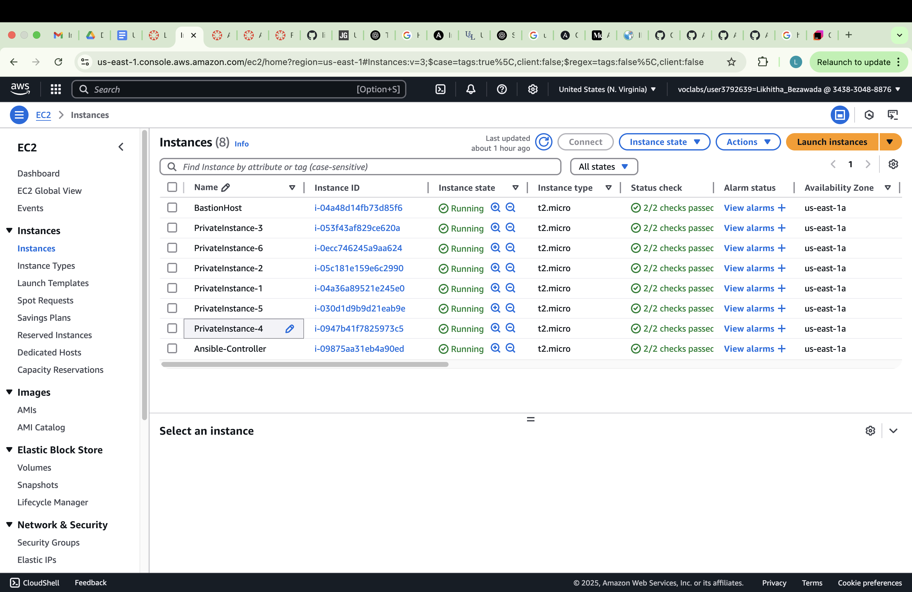
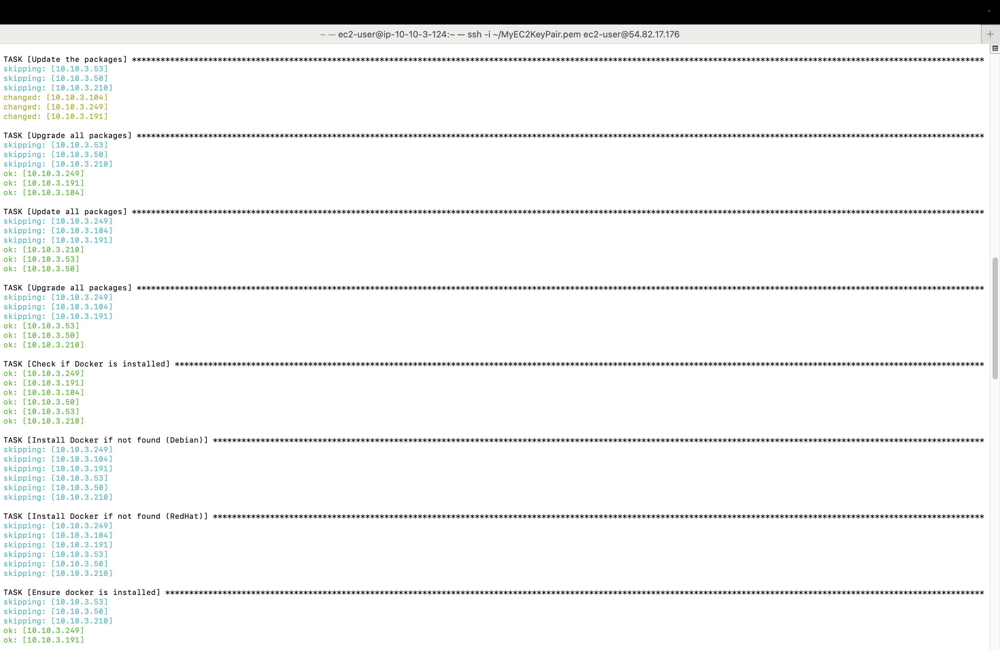
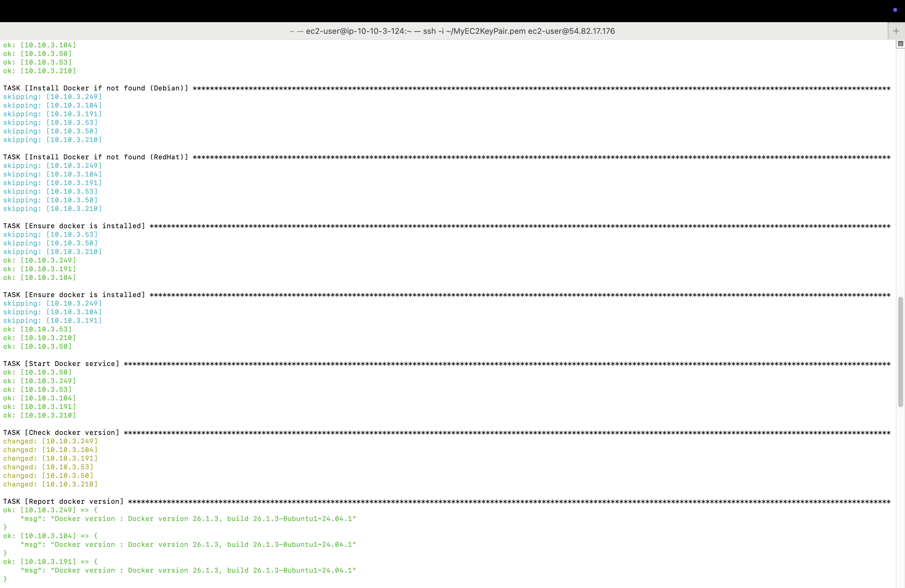
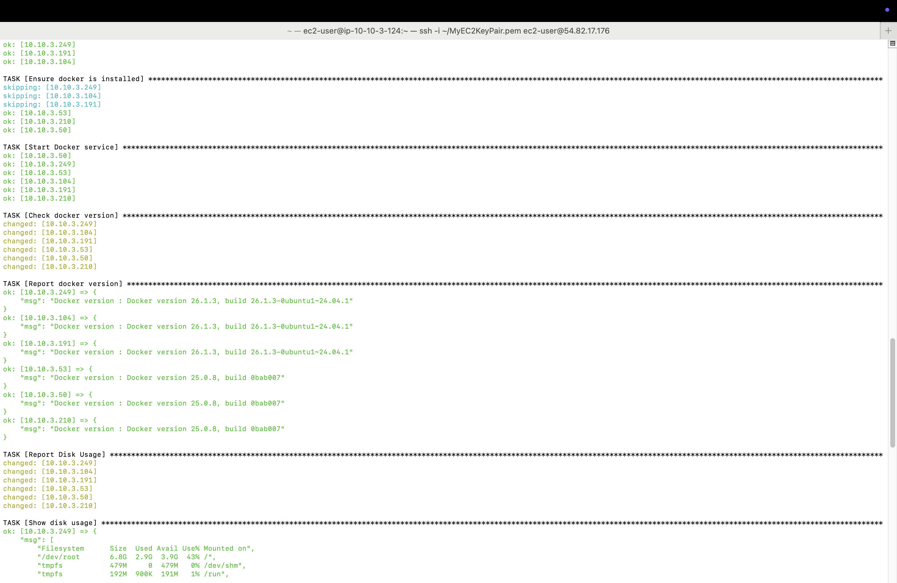
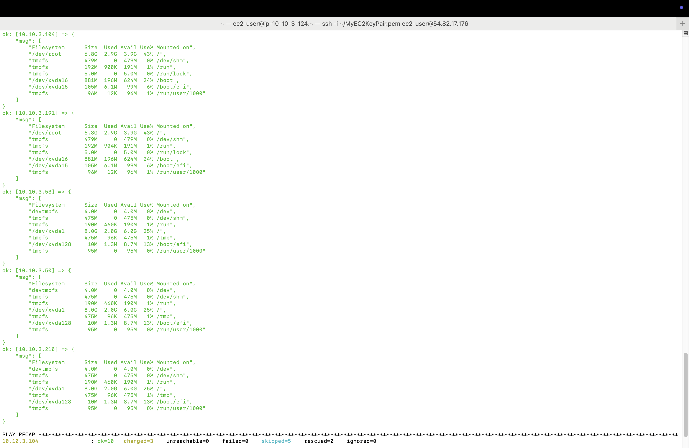

                                                    Packer & Terraform
#Project
This project provisions ec2 instances and verifies installation of docker and disk usage 
using terraform and ansible.

## Features
- Provisions 6 EC2 instances (3 Ubuntu, 3 Amazon Linux)
- Configures an Ansible controller for automation

## Step 1
- Before running the .tf file, configure aws credentials(id, access_key and session_token) or store them in .aws/credentials file.
- run the below commands to provison 6 + 1 ec2 instances.
- terraform init
- terraform plan
- terraform apply
- The above commands will provision ec2 resources and create public and private subnets.
- 

## Step 2
- Update inventory.ini file with the private ip addresses of your 6 ec2 instances except ansible controller one.

## Step 3

- Copy below files through scp to the bastion host using its public ip
- scp -i <path to ssh key .pem> <path to ssh key .pem> ec2-user@<public_ip>:~/    (copies ssh key .pem file)
- scp -i <path to ssh key .pem> <path_to_inventory.ini file> ec2-user@<public_ip>:~/
- scp -i <path to ssh key .pem> <path_to_playbook.ini file> ec2-user@<public_ip>:~/

## Step 4

- SSH to the bastion host using its public IP
- ssh -i <path to ssh key> ec2-user@<public ip>

## Step 5
- Similar to step 5, copy the files ssh key, inventory.ini and playbook.yml from bastion host to the ansible-controller ec2 through scp using its private ip.
- scp -i <path to ssh key .pem> <path to ssh key .pem> ec2-user@<private_ip>:~/    (copies ssh key .pem file)
- scp -i <path to ssh key .pem> <path_to_inventory.ini file> ec2-user@<private_ip>:~/
- scp -i <path to ssh key .pem> <path_to_playbook.ini file> ec2-user@<private_ip>:~/

## Step 6
- Install ansible in ansible-controller ec2
- sudo yum install ansible
- Run the below command to run the playbook
- ansible-playbook -i inventory.ini playbook.yml
- 
- 
- 
- 
